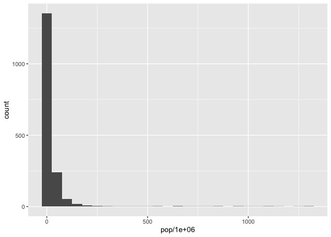

<!--To run the code but show nothing-->


## Exercise 1: Basic __dplyr__

### 1.1 
Use __filter()__ to subset the __gapminder__ data to three countries of your choice in the 1970’s.

```r
gapminder %>% 
  filter(country == "Canada" | country == "Chile" | country == "Cambodia",
         year < 1980 & year > 1969) %>% 
  kable()
```

<table>
 <thead>
  <tr>
   <th style="text-align:left;"> country </th>
   <th style="text-align:left;"> continent </th>
   <th style="text-align:right;"> year </th>
   <th style="text-align:right;"> lifeExp </th>
   <th style="text-align:right;"> pop </th>
   <th style="text-align:right;"> gdpPercap </th>
  </tr>
 </thead>
<tbody>
  <tr>
   <td style="text-align:left;"> Cambodia </td>
   <td style="text-align:left;"> Asia </td>
   <td style="text-align:right;"> 1972 </td>
   <td style="text-align:right;"> 40.317 </td>
   <td style="text-align:right;"> 7450606 </td>
   <td style="text-align:right;"> 421.6240 </td>
  </tr>
  <tr>
   <td style="text-align:left;"> Cambodia </td>
   <td style="text-align:left;"> Asia </td>
   <td style="text-align:right;"> 1977 </td>
   <td style="text-align:right;"> 31.220 </td>
   <td style="text-align:right;"> 6978607 </td>
   <td style="text-align:right;"> 524.9722 </td>
  </tr>
  <tr>
   <td style="text-align:left;"> Canada </td>
   <td style="text-align:left;"> Americas </td>
   <td style="text-align:right;"> 1972 </td>
   <td style="text-align:right;"> 72.880 </td>
   <td style="text-align:right;"> 22284500 </td>
   <td style="text-align:right;"> 18970.5709 </td>
  </tr>
  <tr>
   <td style="text-align:left;"> Canada </td>
   <td style="text-align:left;"> Americas </td>
   <td style="text-align:right;"> 1977 </td>
   <td style="text-align:right;"> 74.210 </td>
   <td style="text-align:right;"> 23796400 </td>
   <td style="text-align:right;"> 22090.8831 </td>
  </tr>
  <tr>
   <td style="text-align:left;"> Chile </td>
   <td style="text-align:left;"> Americas </td>
   <td style="text-align:right;"> 1972 </td>
   <td style="text-align:right;"> 63.441 </td>
   <td style="text-align:right;"> 9717524 </td>
   <td style="text-align:right;"> 5494.0244 </td>
  </tr>
  <tr>
   <td style="text-align:left;"> Chile </td>
   <td style="text-align:left;"> Americas </td>
   <td style="text-align:right;"> 1977 </td>
   <td style="text-align:right;"> 67.052 </td>
   <td style="text-align:right;"> 10599793 </td>
   <td style="text-align:right;"> 4756.7638 </td>
  </tr>
</tbody>
</table>


### 1.2 

Use the pipe operator __%>%__ to select “country” and “gdpPercap” from your filtered dataset in 1.1.

```r
gapminder %>% 
  filter(country == "Canada" | country == "Chile" | country == "Cambodia",
         year < 1980 & year > 1969) %>% 
  select(country, gdpPercap)
```

```
## # A tibble: 6 x 2
##   country  gdpPercap
##   <fct>        <dbl>
## 1 Cambodia      422.
## 2 Cambodia      525.
## 3 Canada      18971.
## 4 Canada      22091.
## 5 Chile        5494.
## 6 Chile        4757.
```

### 1.3 

Filter gapminder to all entries that have experienced a drop in life expectancy. Be sure to include a new variable that’s the increase in life expectancy in your tibble. Hint: you might find the __lag()__ or __diff()__ functions useful.


```r
gapminder %>% 
  arrange(country, year) %>%
  mutate(lifeIncrease = lifeExp - lag(lifeExp)) %>% # lag(lifeExp) finds the previous values of lifeExp
  filter(lifeIncrease < 0, year != 1952)#exclude the first entry of each country, where the lifeIncrease is the difference between two countries 
```

```
## # A tibble: 102 x 7
##    country  continent  year lifeExp     pop gdpPercap lifeIncrease
##    <fct>    <fct>     <int>   <dbl>   <int>     <dbl>        <dbl>
##  1 Albania  Europe     1992    71.6 3326498     2497.       -0.419
##  2 Angola   Africa     1987    39.9 7874230     2430.       -0.036
##  3 Benin    Africa     2002    54.4 7026113     1373.       -0.371
##  4 Botswana Africa     1992    62.7 1342614     7954.       -0.877
##  5 Botswana Africa     1997    52.6 1536536     8647.      -10.2  
##  6 Botswana Africa     2002    46.6 1630347    11004.       -5.92 
##  7 Bulgaria Europe     1977    70.8 8797022     7612.       -0.09 
##  8 Bulgaria Europe     1992    71.2 8658506     6303.       -0.15 
##  9 Bulgaria Europe     1997    70.3 8066057     5970.       -0.87 
## 10 Burundi  Africa     1992    44.7 5809236      632.       -3.48 
## # … with 92 more rows
```

Another solution

```r
gapminder %>% 
  arrange(country, year) %>%
  group_by(country) %>% 
  mutate(lifeIncrease = lifeExp - lag(lifeExp))
```

```
## # A tibble: 1,704 x 7
## # Groups:   country [142]
##    country     continent  year lifeExp      pop gdpPercap lifeIncrease
##    <fct>       <fct>     <int>   <dbl>    <int>     <dbl>        <dbl>
##  1 Afghanistan Asia       1952    28.8  8425333      779.      NA     
##  2 Afghanistan Asia       1957    30.3  9240934      821.       1.53  
##  3 Afghanistan Asia       1962    32.0 10267083      853.       1.66  
##  4 Afghanistan Asia       1967    34.0 11537966      836.       2.02  
##  5 Afghanistan Asia       1972    36.1 13079460      740.       2.07  
##  6 Afghanistan Asia       1977    38.4 14880372      786.       2.35  
##  7 Afghanistan Asia       1982    39.9 12881816      978.       1.42  
##  8 Afghanistan Asia       1987    40.8 13867957      852.       0.968 
##  9 Afghanistan Asia       1992    41.7 16317921      649.       0.852 
## 10 Afghanistan Asia       1997    41.8 22227415      635.       0.0890
## # … with 1,694 more rows
```

### 1.4 

Filter gapminder so that it shows the max GDP per capita experienced by each country. Hint: you might find the __max()__ function useful here.

```r
gapminder %>% 
  group_by(country) %>% 
  mutate(maxgpdPercap = max(gdpPercap)) %>% 
  filter(gdpPercap == maxgpdPercap)
```

```
## # A tibble: 142 x 7
## # Groups:   country [142]
##    country     continent  year lifeExp       pop gdpPercap maxgpdPercap
##    <fct>       <fct>     <int>   <dbl>     <int>     <dbl>        <dbl>
##  1 Afghanistan Asia       1982    39.9  12881816      978.         978.
##  2 Albania     Europe     2007    76.4   3600523     5937.        5937.
##  3 Algeria     Africa     2007    72.3  33333216     6223.        6223.
##  4 Angola      Africa     1967    36.0   5247469     5523.        5523.
##  5 Argentina   Americas   2007    75.3  40301927    12779.       12779.
##  6 Australia   Oceania    2007    81.2  20434176    34435.       34435.
##  7 Austria     Europe     2007    79.8   8199783    36126.       36126.
##  8 Bahrain     Asia       2007    75.6    708573    29796.       29796.
##  9 Bangladesh  Asia       2007    64.1 150448339     1391.        1391.
## 10 Belgium     Europe     2007    79.4  10392226    33693.       33693.
## # … with 132 more rows
```

### 1.5

Produce a scatterplot of Canada’s life expectancy vs. GDP per capita using ggplot2, without defining a new variable. That is, after filtering the gapminder data set, pipe it directly into the __ggplot()__ function. Ensure GDP per capita is on a log scale.


```r
gapminder %>% 
  filter(country == "Canada") %>% 
  ggplot(aes(lifeExp, log(gdpPercap))) +
  geom_point()
```

<!-- -->


## Exercise 2: Explore individual variables with __dplyr__

Pick one categorical variable and one quantitative variable to explore. Answer the following questions in whichever way you think is appropriate, using dplyr:

- What are possible values (or range, whichever is appropriate) of each variable?

- What values are typical? What’s the spread? What’s the distribution? Etc., tailored to the variable at hand.

I picked one categorical variable __country__ and one quantatative variable __pop__.

### country

The possible values of __country__:

```r
gapminder %>% 
  distinct(country)
```

```
## # A tibble: 142 x 1
##    country    
##    <fct>      
##  1 Afghanistan
##  2 Albania    
##  3 Algeria    
##  4 Angola     
##  5 Argentina  
##  6 Australia  
##  7 Austria    
##  8 Bahrain    
##  9 Bangladesh 
## 10 Belgium    
## # … with 132 more rows
```

The count of each possible value of __country__

```r
gapminder %>% 
  group_by(country) %>% 
  count()
```

```
## # A tibble: 142 x 2
## # Groups:   country [142]
##    country         n
##    <fct>       <int>
##  1 Afghanistan    12
##  2 Albania        12
##  3 Algeria        12
##  4 Angola         12
##  5 Argentina      12
##  6 Australia      12
##  7 Austria        12
##  8 Bahrain        12
##  9 Bangladesh     12
## 10 Belgium        12
## # … with 132 more rows
```

### pop

The range of __pop__:

```r
range(gapminder$pop)
```

```
## [1]      60011 1318683096
```

The spread of __pop__:

```r
summary(gapminder$pop)
```

```
##      Min.   1st Qu.    Median      Mean   3rd Qu.      Max. 
## 6.001e+04 2.794e+06 7.024e+06 2.960e+07 1.959e+07 1.319e+09
```

The distribution of __pop__:

```r
ggplot(gapminder, aes(pop/1000000))+
  geom_histogram(binwidth = 50)
```

<!-- -->

The distribution of __pop__ is very right skewed. Most values are below 150 million, while a few outliers are larger than 1 billion.

## Exercise 3: Explore various plot types

- A scatterplot of two quantitative variables.

- One other plot besides a scatterplot.

### Scatterplot
For this exercise, I used __mtcars__. I made a scatterplot of __mpg__(Miles/(US) gallon) and __wt__(Weight (1000 lbs)).
The plot shows a negative relationship between the fuel economy and the weight.

```r
cyl_number <- as.character(mtcars$cyl) #Change the type of cyl into character because there are only three discrete values.
ggplot(mtcars, aes(mpg, wt))+
  geom_point(aes(color= cyl_number))
```

<!-- -->

### Boxplot
I made a boxplot showing the distribution of fuel economy(mpg) of cars with different number of cylinders.

```r
ggplot(mtcars, aes(cyl_number,mpg))+
  geom_boxplot()
```

<!-- -->

