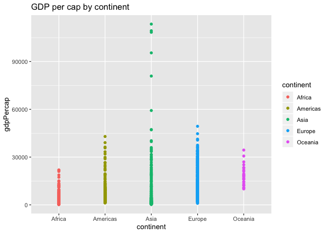

hw03\_dplyr/ggplot2\_Part\_II
================
Margot
25/09/2019

Code from Omar AlOmeir, posted by Jenny Bryan

See
<a href="https://gist.github.com/jennybc/e9e9aba6ba18c72cec26#file-2015-03-02_plot-next-to-table-rmd"  target='_blank'>this
Gist</a> for the code. See [this
RPub](http://rpubs.com/jennybc/plot-next-to-table) for the rendered
HTML.

``` r
library(ggplot2)
```

    ## Warning: package 'ggplot2' was built under R version 3.5.2

``` r
suppressMessages(library(dplyr))
```

    ## Warning: package 'dplyr' was built under R version 3.5.2

``` r
#devtools::install_github("jennybc/gapminder")
library("gapminder")
gtbl <- tbl_df(gapminder)
```

<div class="twoC">

    ## Warning: funs() is soft deprecated as of dplyr 0.8.0
    ## Please use a list of either functions or lambdas: 
    ## 
    ##   # Simple named list: 
    ##   list(mean = mean, median = median)
    ## 
    ##   # Auto named with `tibble::lst()`: 
    ##   tibble::lst(mean, median)
    ## 
    ##   # Using lambdas
    ##   list(~ mean(., trim = .2), ~ median(., na.rm = TRUE))
    ## This warning is displayed once per session.

continent mean median ———- ———- ———- Africa 2193.755 1192.138 Americas
7136.110 5465.510 Asia 7902.150 2646.787 Europe 14469.476 12081.749
Oceania 18621.609 17983.304
<!-- -->

</div>

<div class="clearer">

</div>
