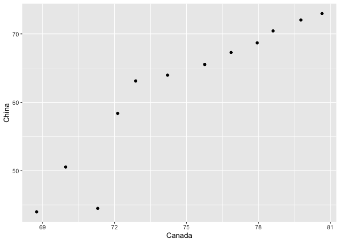

hw04\_Tidy-data-joins
================
Margot
08/10/2019

``` r
library(tidyverse)
```

    ## ── Attaching packages ───────────────────────────────────────────────────────────────── tidyverse 1.2.1 ──

    ## ✔ ggplot2 3.2.1     ✔ purrr   0.3.2
    ## ✔ tibble  2.1.3     ✔ dplyr   0.8.3
    ## ✔ tidyr   1.0.0     ✔ stringr 1.4.0
    ## ✔ readr   1.3.1     ✔ forcats 0.4.0

    ## ── Conflicts ──────────────────────────────────────────────────────────────────── tidyverse_conflicts() ──
    ## ✖ dplyr::filter() masks stats::filter()
    ## ✖ dplyr::lag()    masks stats::lag()

``` r
library(gapminder)
```

## Exercise 1: Univariate Data Reshaping

### Option 1

1.  Make a tibble with one row per year, and columns for life expectancy
    for two or more
countries.

<!-- end list -->

``` r
gap_uni <- gapminder %>% filter(country=="Canada" |country== "China") %>% 
  select(country, year, lifeExp) %>% 
  pivot_wider(id_cols = year,
              names_from = country,
              values_from = lifeExp)
gap_uni
```

    ## # A tibble: 12 x 3
    ##     year Canada China
    ##    <int>  <dbl> <dbl>
    ##  1  1952   68.8  44  
    ##  2  1957   70.0  50.5
    ##  3  1962   71.3  44.5
    ##  4  1967   72.1  58.4
    ##  5  1972   72.9  63.1
    ##  6  1977   74.2  64.0
    ##  7  1982   75.8  65.5
    ##  8  1987   76.9  67.3
    ##  9  1992   78.0  68.7
    ## 10  1997   78.6  70.4
    ## 11  2002   79.8  72.0
    ## 12  2007   80.7  73.0

2.  Take advantage of this new data shape to scatterplot life expectancy
    for one country against that of another.

<!-- end list -->

``` r
ggplot(gap_uni, aes(Canada, China))+
  geom_point()
```

<!-- -->

3.  Re-lengthen the data.

<!-- end list -->

``` r
gap_uni %>% pivot_longer(cols = c("Canada", "China"),
                             names_to = "country",
                             values_to = "lifeExp")
```

    ## # A tibble: 24 x 3
    ##     year country lifeExp
    ##    <int> <chr>     <dbl>
    ##  1  1952 Canada     68.8
    ##  2  1952 China      44  
    ##  3  1957 Canada     70.0
    ##  4  1957 China      50.5
    ##  5  1962 Canada     71.3
    ##  6  1962 China      44.5
    ##  7  1967 Canada     72.1
    ##  8  1967 China      58.4
    ##  9  1972 Canada     72.9
    ## 10  1972 China      63.1
    ## # … with 14 more rows

## Exercise 2: Multivariate Data Reshaping

### Option 1

1.  Make a tibble with one row per year, and columns for life expectancy
    and GDP per capita (or two other numeric variables) for two or more
    countries.

<!-- end list -->

``` r
gap_multi <- gapminder %>% filter(country=="Cambodia" | country=="Egypt") %>% 
  select(year, country, lifeExp, gdpPercap) %>% 
  pivot_wider(id_cols = year,
              names_from = country,
              values_from = c(lifeExp, gdpPercap))
gap_multi
```

    ## # A tibble: 12 x 5
    ##     year lifeExp_Cambodia lifeExp_Egypt gdpPercap_Cambodia gdpPercap_Egypt
    ##    <int>            <dbl>         <dbl>              <dbl>           <dbl>
    ##  1  1952             39.4          41.9               368.           1419.
    ##  2  1957             41.4          44.4               434.           1459.
    ##  3  1962             43.4          47.0               497.           1693.
    ##  4  1967             45.4          49.3               523.           1815.
    ##  5  1972             40.3          51.1               422.           2024.
    ##  6  1977             31.2          53.3               525.           2785.
    ##  7  1982             51.0          56.0               624.           3504.
    ##  8  1987             53.9          59.8               684.           3885.
    ##  9  1992             55.8          63.7               682.           3795.
    ## 10  1997             56.5          67.2               734.           4173.
    ## 11  2002             56.8          69.8               896.           4755.
    ## 12  2007             59.7          71.3              1714.           5581.

2.  Re-lengthen the data.

<!-- end list -->

``` r
gap_multi %>% pivot_longer(cols = -year,
                           names_to = c(".value", "country"),
                           names_sep = "_")
```

    ## # A tibble: 24 x 4
    ##     year country  lifeExp gdpPercap
    ##    <int> <chr>      <dbl>     <dbl>
    ##  1  1952 Cambodia    39.4      368.
    ##  2  1952 Egypt       41.9     1419.
    ##  3  1957 Cambodia    41.4      434.
    ##  4  1957 Egypt       44.4     1459.
    ##  5  1962 Cambodia    43.4      497.
    ##  6  1962 Egypt       47.0     1693.
    ##  7  1967 Cambodia    45.4      523.
    ##  8  1967 Egypt       49.3     1815.
    ##  9  1972 Cambodia    40.3      422.
    ## 10  1972 Egypt       51.1     2024.
    ## # … with 14 more rows

## Exercise 3: Table Joins

``` r
head(guest)
```

    ## # A tibble: 6 x 7
    ##   party name  meal_wedding meal_brunch attendance_wedd… attendance_brun…
    ##   <dbl> <chr> <chr>        <chr>       <chr>            <chr>           
    ## 1     1 Somm… PENDING      PENDING     PENDING          PENDING         
    ## 2     1 Phil… vegetarian   Menu C      CONFIRMED        CONFIRMED       
    ## 3     1 Blan… chicken      Menu A      CONFIRMED        CONFIRMED       
    ## 4     1 Emaa… PENDING      PENDING     PENDING          PENDING         
    ## 5     2 Blai… chicken      Menu C      CONFIRMED        CONFIRMED       
    ## 6     2 Nige… <NA>         <NA>        CANCELLED        CANCELLED       
    ## # … with 1 more variable: attendance_golf <chr>

``` r
head(email)
```

    ## # A tibble: 6 x 2
    ##   guest                                                   email            
    ##   <chr>                                                   <chr>            
    ## 1 Sommer Medrano, Phillip Medrano, Blanka Medrano, Emaan… sommm@gmail.com  
    ## 2 Blair Park, Nigel Webb                                  bpark@gmail.com  
    ## 3 Sinead English                                          singlish@hotmail…
    ## 4 Ayra Marks                                              marksa42@gmail.c…
    ## 5 Jolene Welsh, Hayley Booker                             jw1987@hotmail.c…
    ## 6 Amayah Sanford, Erika Foley                             erikaaaaaa@gmail…

3.1 For each guest in the guestlist (guest tibble), add a column for
email address, which can be found in the email
tibble.

``` r
emails <- email %>% separate_rows(guest, sep = ", ") %>% # seperate a collapsed column into multiple rows. Notice the sep is one comma and one white space
  mutate(name = guest) %>% 
  select(name, email)
emails
```

    ## # A tibble: 28 x 2
    ##    name            email              
    ##    <chr>           <chr>              
    ##  1 Sommer Medrano  sommm@gmail.com    
    ##  2 Phillip Medrano sommm@gmail.com    
    ##  3 Blanka Medrano  sommm@gmail.com    
    ##  4 Emaan Medrano   sommm@gmail.com    
    ##  5 Blair Park      bpark@gmail.com    
    ##  6 Nigel Webb      bpark@gmail.com    
    ##  7 Sinead English  singlish@hotmail.ca
    ##  8 Ayra Marks      marksa42@gmail.com 
    ##  9 Jolene Welsh    jw1987@hotmail.com 
    ## 10 Hayley Booker   jw1987@hotmail.com 
    ## # … with 18 more rows

``` r
guest %>% 
  left_join(emails, by="name")
```

    ## # A tibble: 30 x 8
    ##    party name  meal_wedding meal_brunch attendance_wedd… attendance_brun…
    ##    <dbl> <chr> <chr>        <chr>       <chr>            <chr>           
    ##  1     1 Somm… PENDING      PENDING     PENDING          PENDING         
    ##  2     1 Phil… vegetarian   Menu C      CONFIRMED        CONFIRMED       
    ##  3     1 Blan… chicken      Menu A      CONFIRMED        CONFIRMED       
    ##  4     1 Emaa… PENDING      PENDING     PENDING          PENDING         
    ##  5     2 Blai… chicken      Menu C      CONFIRMED        CONFIRMED       
    ##  6     2 Nige… <NA>         <NA>        CANCELLED        CANCELLED       
    ##  7     3 Sine… PENDING      PENDING     PENDING          PENDING         
    ##  8     4 Ayra… vegetarian   Menu B      PENDING          PENDING         
    ##  9     5 Atla… PENDING      PENDING     PENDING          PENDING         
    ## 10     5 Denz… fish         Menu B      CONFIRMED        CONFIRMED       
    ## # … with 20 more rows, and 2 more variables: attendance_golf <chr>,
    ## #   email <chr>

3.2 Who do we have emails for, yet are not on the guestlist?

``` r
emails %>% anti_join(guest, by="name")
```

    ## # A tibble: 3 x 2
    ##   name            email                          
    ##   <chr>           <chr>                          
    ## 1 Turner Jones    tjjones12@hotmail.ca           
    ## 2 Albert Marshall themarshallfamily1234@gmail.com
    ## 3 Vivian Marshall themarshallfamily1234@gmail.com

3.3 Make a guestlist that includes everyone we have emails for (in
addition to those on the original guestlist).

``` r
guest %>% full_join(emails, by="name")
```

    ## # A tibble: 33 x 8
    ##    party name  meal_wedding meal_brunch attendance_wedd… attendance_brun…
    ##    <dbl> <chr> <chr>        <chr>       <chr>            <chr>           
    ##  1     1 Somm… PENDING      PENDING     PENDING          PENDING         
    ##  2     1 Phil… vegetarian   Menu C      CONFIRMED        CONFIRMED       
    ##  3     1 Blan… chicken      Menu A      CONFIRMED        CONFIRMED       
    ##  4     1 Emaa… PENDING      PENDING     PENDING          PENDING         
    ##  5     2 Blai… chicken      Menu C      CONFIRMED        CONFIRMED       
    ##  6     2 Nige… <NA>         <NA>        CANCELLED        CANCELLED       
    ##  7     3 Sine… PENDING      PENDING     PENDING          PENDING         
    ##  8     4 Ayra… vegetarian   Menu B      PENDING          PENDING         
    ##  9     5 Atla… PENDING      PENDING     PENDING          PENDING         
    ## 10     5 Denz… fish         Menu B      CONFIRMED        CONFIRMED       
    ## # … with 23 more rows, and 2 more variables: attendance_golf <chr>,
    ## #   email <chr>
