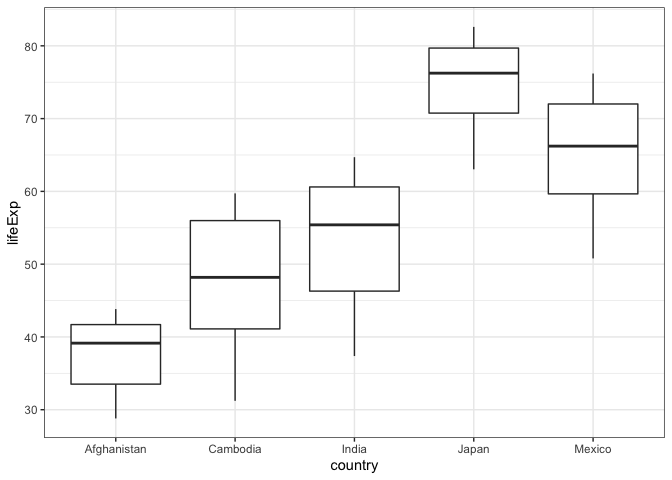
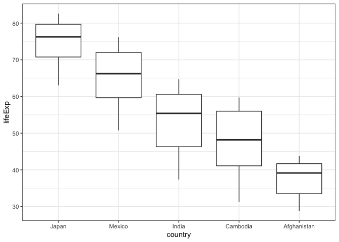
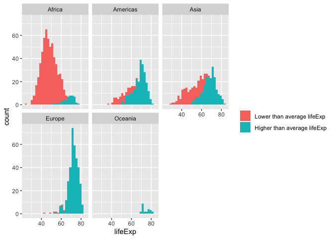
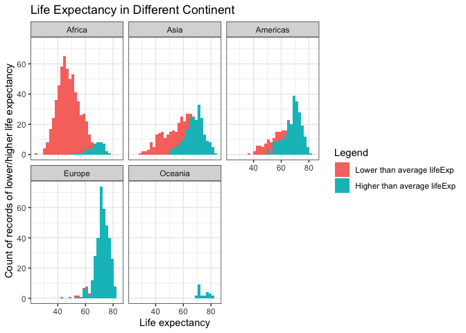

## Exercise 1: Explain the value of the here::here package
- `here::here` makes it easier and safer to write the file paths in different operating systems.
- It also makes it easier to manage sub-directories in a project. We can get data from other sub-directories and save output to other sub-directories.
- It allows people to run your code on their machine and supports reproducibility.

## Exercise 2: Factor management

### 2.1 Drop factor / levels


```r
class(gapminder$continent)
```

```
## [1] "factor"
```

```r
class(gapminder$country)
```

```
## [1] "factor"
```
In `gapminder`, `country` and `continent` are factors.


```r
four_continent <- gapminder %>% filter(continent != "Oceania")
nlevels(four_continent$continent)
```

```
## [1] 5
```


```r
continent_dropped <- four_continent %>% droplevels()
nlevels(continent_dropped$continent)
```

```
## [1] 4
```

There are 5 levels of `continent`. After applying `droplevels()`, there are 4 left.

### 2.2 Reorder levels based on knowledge from data.


```r
df1 <-gapminder %>% 
  filter(country %in% c("Afghanistan", "Cambodia",  "India", "Japan", "Mexico")) 
df1 %>% arrange(country) %>% DT::datatable()
```

<!--html_preserve--><div id="htmlwidget-27ae11a7ce4bdf8ff6a5" style="width:100%;height:auto;" class="datatables html-widget"></div>
<script type="application/json" data-for="htmlwidget-27ae11a7ce4bdf8ff6a5">{"x":{"filter":"none","data":[["1","2","3","4","5","6","7","8","9","10","11","12","13","14","15","16","17","18","19","20","21","22","23","24","25","26","27","28","29","30","31","32","33","34","35","36","37","38","39","40","41","42","43","44","45","46","47","48","49","50","51","52","53","54","55","56","57","58","59","60"],["Afghanistan","Afghanistan","Afghanistan","Afghanistan","Afghanistan","Afghanistan","Afghanistan","Afghanistan","Afghanistan","Afghanistan","Afghanistan","Afghanistan","Cambodia","Cambodia","Cambodia","Cambodia","Cambodia","Cambodia","Cambodia","Cambodia","Cambodia","Cambodia","Cambodia","Cambodia","India","India","India","India","India","India","India","India","India","India","India","India","Japan","Japan","Japan","Japan","Japan","Japan","Japan","Japan","Japan","Japan","Japan","Japan","Mexico","Mexico","Mexico","Mexico","Mexico","Mexico","Mexico","Mexico","Mexico","Mexico","Mexico","Mexico"],["Asia","Asia","Asia","Asia","Asia","Asia","Asia","Asia","Asia","Asia","Asia","Asia","Asia","Asia","Asia","Asia","Asia","Asia","Asia","Asia","Asia","Asia","Asia","Asia","Asia","Asia","Asia","Asia","Asia","Asia","Asia","Asia","Asia","Asia","Asia","Asia","Asia","Asia","Asia","Asia","Asia","Asia","Asia","Asia","Asia","Asia","Asia","Asia","Americas","Americas","Americas","Americas","Americas","Americas","Americas","Americas","Americas","Americas","Americas","Americas"],[1952,1957,1962,1967,1972,1977,1982,1987,1992,1997,2002,2007,1952,1957,1962,1967,1972,1977,1982,1987,1992,1997,2002,2007,1952,1957,1962,1967,1972,1977,1982,1987,1992,1997,2002,2007,1952,1957,1962,1967,1972,1977,1982,1987,1992,1997,2002,2007,1952,1957,1962,1967,1972,1977,1982,1987,1992,1997,2002,2007],[28.801,30.332,31.997,34.02,36.088,38.438,39.854,40.822,41.674,41.763,42.129,43.828,39.417,41.366,43.415,45.415,40.317,31.22,50.957,53.914,55.803,56.534,56.752,59.723,37.373,40.249,43.605,47.193,50.651,54.208,56.596,58.553,60.223,61.765,62.879,64.698,63.03,65.5,68.73,71.43,73.42,75.38,77.11,78.67,79.36,80.69,82,82.603,50.789,55.19,58.299,60.11,62.361,65.032,67.405,69.498,71.455,73.67,74.902,76.195],[8425333,9240934,10267083,11537966,13079460,14880372,12881816,13867957,16317921,22227415,25268405,31889923,4693836,5322536,6083619,6960067,7450606,6978607,7272485,8371791,10150094,11782962,12926707,14131858,372000000,409000000,454000000,506000000,567000000,634000000,708000000,788000000,872000000,959000000,1034172547,1110396331,86459025,91563009,95831757,100825279,107188273,113872473,118454974,122091325,124329269,125956499,127065841,127467972,30144317,35015548,41121485,47995559,55984294,63759976,71640904,80122492,88111030,95895146,102479927,108700891],[779.4453145,820.8530296,853.10071,836.1971382,739.9811058,786.11336,978.0114388,852.3959448,649.3413952,635.341351,726.7340548,974.5803384,368.4692856,434.0383364,496.9136476,523.4323142,421.6240257,524.9721832,624.4754784,683.8955732,682.3031755,734.28517,896.2260153,1713.778686,546.5657493,590.061996,658.3471509,700.7706107,724.032527,813.337323,855.7235377,976.5126756,1164.406809,1458.817442,1746.769454,2452.210407,3216.956347,4317.694365,6576.649461,9847.788607,14778.78636,16610.37701,19384.10571,22375.94189,26824.89511,28816.58499,28604.5919,31656.06806,3478.125529,4131.546641,4581.609385,5754.733883,6809.40669,7674.929108,9611.147541,8688.156003,9472.384295,9767.29753,10742.44053,11977.57496]],"container":"<table class=\"display\">\n  <thead>\n    <tr>\n      <th> <\/th>\n      <th>country<\/th>\n      <th>continent<\/th>\n      <th>year<\/th>\n      <th>lifeExp<\/th>\n      <th>pop<\/th>\n      <th>gdpPercap<\/th>\n    <\/tr>\n  <\/thead>\n<\/table>","options":{"columnDefs":[{"className":"dt-right","targets":[3,4,5,6]},{"orderable":false,"targets":0}],"order":[],"autoWidth":false,"orderClasses":false}},"evals":[],"jsHooks":[]}</script><!--/html_preserve-->


```r
df1 %>% ggplot()+
  geom_boxplot(aes(country, lifeExp))+
  theme_bw()
```

<!-- -->

In the original tibble, countries are ordered alphabetically.


```r
df2 <- df1 %>% arrange(fct_reorder(country, lifeExp, max, .desc =TRUE)) 
DT::datatable(df2)
```

<!--html_preserve--><div id="htmlwidget-08181f0eb2c66d8a1b91" style="width:100%;height:auto;" class="datatables html-widget"></div>
<script type="application/json" data-for="htmlwidget-08181f0eb2c66d8a1b91">{"x":{"filter":"none","data":[["1","2","3","4","5","6","7","8","9","10","11","12","13","14","15","16","17","18","19","20","21","22","23","24","25","26","27","28","29","30","31","32","33","34","35","36","37","38","39","40","41","42","43","44","45","46","47","48","49","50","51","52","53","54","55","56","57","58","59","60"],["Japan","Japan","Japan","Japan","Japan","Japan","Japan","Japan","Japan","Japan","Japan","Japan","Mexico","Mexico","Mexico","Mexico","Mexico","Mexico","Mexico","Mexico","Mexico","Mexico","Mexico","Mexico","India","India","India","India","India","India","India","India","India","India","India","India","Cambodia","Cambodia","Cambodia","Cambodia","Cambodia","Cambodia","Cambodia","Cambodia","Cambodia","Cambodia","Cambodia","Cambodia","Afghanistan","Afghanistan","Afghanistan","Afghanistan","Afghanistan","Afghanistan","Afghanistan","Afghanistan","Afghanistan","Afghanistan","Afghanistan","Afghanistan"],["Asia","Asia","Asia","Asia","Asia","Asia","Asia","Asia","Asia","Asia","Asia","Asia","Americas","Americas","Americas","Americas","Americas","Americas","Americas","Americas","Americas","Americas","Americas","Americas","Asia","Asia","Asia","Asia","Asia","Asia","Asia","Asia","Asia","Asia","Asia","Asia","Asia","Asia","Asia","Asia","Asia","Asia","Asia","Asia","Asia","Asia","Asia","Asia","Asia","Asia","Asia","Asia","Asia","Asia","Asia","Asia","Asia","Asia","Asia","Asia"],[1952,1957,1962,1967,1972,1977,1982,1987,1992,1997,2002,2007,1952,1957,1962,1967,1972,1977,1982,1987,1992,1997,2002,2007,1952,1957,1962,1967,1972,1977,1982,1987,1992,1997,2002,2007,1952,1957,1962,1967,1972,1977,1982,1987,1992,1997,2002,2007,1952,1957,1962,1967,1972,1977,1982,1987,1992,1997,2002,2007],[63.03,65.5,68.73,71.43,73.42,75.38,77.11,78.67,79.36,80.69,82,82.603,50.789,55.19,58.299,60.11,62.361,65.032,67.405,69.498,71.455,73.67,74.902,76.195,37.373,40.249,43.605,47.193,50.651,54.208,56.596,58.553,60.223,61.765,62.879,64.698,39.417,41.366,43.415,45.415,40.317,31.22,50.957,53.914,55.803,56.534,56.752,59.723,28.801,30.332,31.997,34.02,36.088,38.438,39.854,40.822,41.674,41.763,42.129,43.828],[86459025,91563009,95831757,100825279,107188273,113872473,118454974,122091325,124329269,125956499,127065841,127467972,30144317,35015548,41121485,47995559,55984294,63759976,71640904,80122492,88111030,95895146,102479927,108700891,372000000,409000000,454000000,506000000,567000000,634000000,708000000,788000000,872000000,959000000,1034172547,1110396331,4693836,5322536,6083619,6960067,7450606,6978607,7272485,8371791,10150094,11782962,12926707,14131858,8425333,9240934,10267083,11537966,13079460,14880372,12881816,13867957,16317921,22227415,25268405,31889923],[3216.956347,4317.694365,6576.649461,9847.788607,14778.78636,16610.37701,19384.10571,22375.94189,26824.89511,28816.58499,28604.5919,31656.06806,3478.125529,4131.546641,4581.609385,5754.733883,6809.40669,7674.929108,9611.147541,8688.156003,9472.384295,9767.29753,10742.44053,11977.57496,546.5657493,590.061996,658.3471509,700.7706107,724.032527,813.337323,855.7235377,976.5126756,1164.406809,1458.817442,1746.769454,2452.210407,368.4692856,434.0383364,496.9136476,523.4323142,421.6240257,524.9721832,624.4754784,683.8955732,682.3031755,734.28517,896.2260153,1713.778686,779.4453145,820.8530296,853.10071,836.1971382,739.9811058,786.11336,978.0114388,852.3959448,649.3413952,635.341351,726.7340548,974.5803384]],"container":"<table class=\"display\">\n  <thead>\n    <tr>\n      <th> <\/th>\n      <th>country<\/th>\n      <th>continent<\/th>\n      <th>year<\/th>\n      <th>lifeExp<\/th>\n      <th>pop<\/th>\n      <th>gdpPercap<\/th>\n    <\/tr>\n  <\/thead>\n<\/table>","options":{"columnDefs":[{"className":"dt-right","targets":[3,4,5,6]},{"orderable":false,"targets":0}],"order":[],"autoWidth":false,"orderClasses":false}},"evals":[],"jsHooks":[]}</script><!--/html_preserve-->


```r
df2 %>% ggplot()+
  geom_boxplot(aes(fct_reorder(country, lifeExp, max, .desc =TRUE), lifeExp))+
  xlab("country")+
  theme_bw()
```

<!-- -->

In the reordered tibble, countries are ordered by the maximum of `lifeExp`, from the biggest to the smallest.

## Exercise 3: File input/output (I/O)

I use `df1`, a tibble I created in the last section for Exercise 3. First, I export it to disk.


```r
write_csv(df1, here::here("hw05", "df1.csv"))
```

Then reload `df1` back.


```r
my_data <- read_csv(here::here("hw05", "df1.csv"))
```

```
## Parsed with column specification:
## cols(
##   country = col_character(),
##   continent = col_character(),
##   year = col_double(),
##   lifeExp = col_double(),
##   pop = col_double(),
##   gdpPercap = col_double()
## )
```

```r
str(my_data) #read_csv() doesn’t convert character vectors to factors
```

```
## Classes 'spec_tbl_df', 'tbl_df', 'tbl' and 'data.frame':	60 obs. of  6 variables:
##  $ country  : chr  "Afghanistan" "Afghanistan" "Afghanistan" "Afghanistan" ...
##  $ continent: chr  "Asia" "Asia" "Asia" "Asia" ...
##  $ year     : num  1952 1957 1962 1967 1972 ...
##  $ lifeExp  : num  28.8 30.3 32 34 36.1 ...
##  $ pop      : num  8425333 9240934 10267083 11537966 13079460 ...
##  $ gdpPercap: num  779 821 853 836 740 ...
##  - attr(*, "spec")=
##   .. cols(
##   ..   country = col_character(),
##   ..   continent = col_character(),
##   ..   year = col_double(),
##   ..   lifeExp = col_double(),
##   ..   pop = col_double(),
##   ..   gdpPercap = col_double()
##   .. )
```


```r
my_data %>% 
  arrange(fct_infreq(country)) %>%  # forcats works on factors (or character vectors)
  DT::datatable()
```

<!--html_preserve--><div id="htmlwidget-41a3c108442328fa95d9" style="width:100%;height:auto;" class="datatables html-widget"></div>
<script type="application/json" data-for="htmlwidget-41a3c108442328fa95d9">{"x":{"filter":"none","data":[["1","2","3","4","5","6","7","8","9","10","11","12","13","14","15","16","17","18","19","20","21","22","23","24","25","26","27","28","29","30","31","32","33","34","35","36","37","38","39","40","41","42","43","44","45","46","47","48","49","50","51","52","53","54","55","56","57","58","59","60"],["Afghanistan","Afghanistan","Afghanistan","Afghanistan","Afghanistan","Afghanistan","Afghanistan","Afghanistan","Afghanistan","Afghanistan","Afghanistan","Afghanistan","Cambodia","Cambodia","Cambodia","Cambodia","Cambodia","Cambodia","Cambodia","Cambodia","Cambodia","Cambodia","Cambodia","Cambodia","India","India","India","India","India","India","India","India","India","India","India","India","Japan","Japan","Japan","Japan","Japan","Japan","Japan","Japan","Japan","Japan","Japan","Japan","Mexico","Mexico","Mexico","Mexico","Mexico","Mexico","Mexico","Mexico","Mexico","Mexico","Mexico","Mexico"],["Asia","Asia","Asia","Asia","Asia","Asia","Asia","Asia","Asia","Asia","Asia","Asia","Asia","Asia","Asia","Asia","Asia","Asia","Asia","Asia","Asia","Asia","Asia","Asia","Asia","Asia","Asia","Asia","Asia","Asia","Asia","Asia","Asia","Asia","Asia","Asia","Asia","Asia","Asia","Asia","Asia","Asia","Asia","Asia","Asia","Asia","Asia","Asia","Americas","Americas","Americas","Americas","Americas","Americas","Americas","Americas","Americas","Americas","Americas","Americas"],[1952,1957,1962,1967,1972,1977,1982,1987,1992,1997,2002,2007,1952,1957,1962,1967,1972,1977,1982,1987,1992,1997,2002,2007,1952,1957,1962,1967,1972,1977,1982,1987,1992,1997,2002,2007,1952,1957,1962,1967,1972,1977,1982,1987,1992,1997,2002,2007,1952,1957,1962,1967,1972,1977,1982,1987,1992,1997,2002,2007],[28.801,30.332,31.997,34.02,36.088,38.438,39.854,40.822,41.674,41.763,42.129,43.828,39.417,41.366,43.415,45.415,40.317,31.22,50.957,53.914,55.803,56.534,56.752,59.723,37.373,40.249,43.605,47.193,50.651,54.208,56.596,58.553,60.223,61.765,62.879,64.698,63.03,65.5,68.73,71.43,73.42,75.38,77.11,78.67,79.36,80.69,82,82.603,50.789,55.19,58.299,60.11,62.361,65.032,67.405,69.498,71.455,73.67,74.902,76.195],[8425333,9240934,10267083,11537966,13079460,14880372,12881816,13867957,16317921,22227415,25268405,31889923,4693836,5322536,6083619,6960067,7450606,6978607,7272485,8371791,10150094,11782962,12926707,14131858,372000000,409000000,454000000,506000000,567000000,634000000,708000000,788000000,872000000,959000000,1034172547,1110396331,86459025,91563009,95831757,100825279,107188273,113872473,118454974,122091325,124329269,125956499,127065841,127467972,30144317,35015548,41121485,47995559,55984294,63759976,71640904,80122492,88111030,95895146,102479927,108700891],[779.4453145,820.8530296,853.10071,836.1971382,739.9811058,786.11336,978.0114388,852.3959448,649.3413952,635.341351,726.7340548,974.5803384,368.4692856,434.0383364,496.9136476,523.4323142,421.6240257,524.9721832,624.4754784,683.8955732,682.3031755,734.28517,896.2260153,1713.778686,546.5657493,590.061996,658.3471509,700.7706107,724.032527,813.337323,855.7235377,976.5126756,1164.406809,1458.817442,1746.769454,2452.210407,3216.956347,4317.694365,6576.649461,9847.788607,14778.78636,16610.37701,19384.10571,22375.94189,26824.89511,28816.58499,28604.5919,31656.06806,3478.125529,4131.546641,4581.609385,5754.733883,6809.40669,7674.929108,9611.147541,8688.156003,9472.384295,9767.29753,10742.44053,11977.57496]],"container":"<table class=\"display\">\n  <thead>\n    <tr>\n      <th> <\/th>\n      <th>country<\/th>\n      <th>continent<\/th>\n      <th>year<\/th>\n      <th>lifeExp<\/th>\n      <th>pop<\/th>\n      <th>gdpPercap<\/th>\n    <\/tr>\n  <\/thead>\n<\/table>","options":{"columnDefs":[{"className":"dt-right","targets":[3,4,5,6]},{"orderable":false,"targets":0}],"order":[],"autoWidth":false,"orderClasses":false}},"evals":[],"jsHooks":[]}</script><!--/html_preserve-->

After applying `relevel()`, Mexico became the first country in the table.

## Exercise 4: Visualization design

The original vis:


```r
p <- gapminder %>% # store image in p for storing in the exercise
  group_by(year) %>% 
  mutate(life_mean = mean(lifeExp)) %>% 
  ggplot(aes(lifeExp))+
  facet_wrap(~ continent)+
  geom_histogram(aes(fill=lifeExp>life_mean))+
  scale_fill_discrete("", labels=c("Lower than average lifeExp", "Higher than average lifeExp"))
p
```

<!-- -->

The new vis:


```r
gapminder %>% 
  group_by(year) %>% 
  mutate(life_mean = mean(lifeExp)) %>% 
  mutate(continent=fct_reorder(continent, lifeExp, median)) %>% #order continents by median lifeExp
  ggplot(aes(lifeExp))+
  facet_wrap(~ continent)+
  geom_histogram(aes(fill=lifeExp>life_mean))+
  scale_fill_discrete("Legend", labels=c("Lower than average lifeExp", "Higher than average lifeExp")) +
  ylab("Count of records of lower/higher life expectancy")+
  xlab("Life expectancy")+
  labs(title = "Life Expectancy in Different Continent")+
  theme_bw()
```

<!-- -->

### Things I did differently:
- Add label, title, and legend to make the figure more informative. 
- Remove background to reduce distraction. 
- Reordered the continents to make the pattern more obvious.

## Exercise 5: Writing figures to file

I don't want to save the last image. So I use `plot=` to point out the image I want do save.


```r
ggsave(here("hw05", "life_exp.png"), plot=p, width = 7, height = 4)
```

Here is the [*Old Figure*](life_exp.png)
